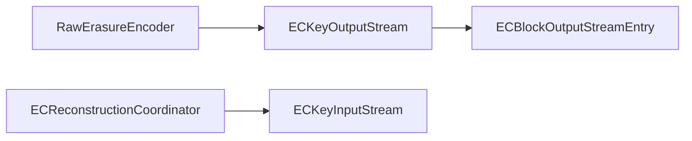

# Erasure coding end-to-end

Client-side EC encode → per-cell dispatch → DN reconstruction. Covers the Rs/Xor raw coders and the reconstruction coordinator.

1365 minutes · 44 classes

## Flow walkthrough
Writes: ECKeyOutputStream drives a RawErasureEncoder over the incoming stripes, then hands each data-and-parity cell to ECBlockOutputStreamEntry. Reads: ECKeyInputStream goes through ECBlockReconstructedStripeInputStream when cells are missing.

## Key classes on this path

1

<strong><a href="/class/eckeyoutputstream">ECKeyOutputStream</a></strong>

ECKeyOutputStream handles the EC writes by writing the data into underlying block output streams chunk by chunk.

Client/ozone-client · 60 min

2

<strong><a href="/class/ecblockoutputstreamentry">ECBlockOutputStreamEntry</a></strong>

ECBlockOutputStreamEntry manages write into EC keys' data block groups.

Client/ozone-client · 45 min

3

<strong><a href="/class/ecblockreconstructedstripeinputstream">ECBlockReconstructedStripeInputStream</a></strong>

Class to read EC encoded data from blocks a stripe at a time, when some of the data blocks are not available.

Client/hdds-client · 60 min

4

<strong><a href="/class/rawerasuredecoder">RawErasureDecoder</a></strong>

An abstract raw erasure decoder that's to be inherited by new decoders.

DN/erasure-coding · 30 min

5

<strong><a href="/class/rawerasureencoder">RawErasureEncoder</a></strong>

An abstract raw erasure encoder that's to be inherited by new encoders.

DN/erasure-coding · 30 min

6

<strong><a href="/class/abstractnativerawdecoder">AbstractNativeRawDecoder</a></strong>

Abstract native raw decoder for all native coders to extend with.

DN/erasure-coding · 30 min

7

<strong><a href="/class/abstractnativerawencoder">AbstractNativeRawEncoder</a></strong>

Abstract native raw encoder for all native coders to extend with.

DN/erasure-coding · 30 min

8

<strong><a href="/class/encodingstate">EncodingState</a></strong>

A utility class that maintains encoding state during an encode call.

DN/erasure-coding · 30 min

9

<strong><a href="/class/ecreconstructioncoordinator">ECReconstructionCoordinator</a></strong>

The Coordinator implements the main flow of reconstructing missing container replicas.

DN/erasure-coding · 60 min

10

<strong><a href="/class/galoisfield">GaloisField</a></strong>

Implementation of Galois field arithmetic with 2^p elements.

DN/erasure-coding · 45 min

## What to understand before moving on
- Explain the service boundary crossings in this path: Client -> DN.
- Name the entry-point classes and the class that owns each durable state change.
- Identify the retry, failure, or cleanup behavior that keeps the path correct when a service is slow or unavailable.
- Open the individual class pages for invariants, sharp edges, source links, and test exemplars.
- Use these tags as anchors when searching later: `ec`, `hot-path`.
## Full reading list
### Client — 3 classes · 165 min

**[hdds-client](/component/client/hdds-client)** · 1 · 60 min

- [ECBlockReconstructedStripeInputStream](/class/ecblockreconstructedstripeinputstream) — Class to read EC encoded data from blocks a stripe at a time, when some of the data blocks are not available. 60 min

**[ozone-client](/component/client/ozone-client)** · 2 · 105 min

- [ECKeyOutputStream](/class/eckeyoutputstream) — ECKeyOutputStream handles the EC writes by writing the data into underlying block output streams chunk by chunk. 60 min
- [ECBlockOutputStreamEntry](/class/ecblockoutputstreamentry) — ECBlockOutputStreamEntry manages write into EC keys' data block groups. 45 min

### DN — 41 classes · 1200 min

**[erasure-coding](/component/dn/erasure-coding)** · 41 · 1200 min

- [ECReconstructionCoordinator](/class/ecreconstructioncoordinator) — The Coordinator implements the main flow of reconstructing missing container replicas. 60 min
- [ECReconstructionCoordinatorTask](/class/ecreconstructioncoordinatortask) — This is the actual EC reconstruction coordination task. 30 min
- [ECReconstructionCommandInfo](/class/ecreconstructioncommandinfo) — This class is to keep the required EC reconstruction info. 10 min
- [ECReconstructionMetrics](/class/ecreconstructionmetrics) — Metrics class for EC Reconstruction. 20 min
- [RawErasureDecoder](/class/rawerasuredecoder) — An abstract raw erasure decoder that's to be inherited by new decoders. 30 min
- [RawErasureEncoder](/class/rawerasureencoder) — An abstract raw erasure encoder that's to be inherited by new encoders. 30 min
- [AbstractNativeRawDecoder](/class/abstractnativerawdecoder) — Abstract native raw decoder for all native coders to extend with. 30 min
- [AbstractNativeRawEncoder](/class/abstractnativerawencoder) — Abstract native raw encoder for all native coders to extend with. 30 min
- [RSUtil](/class/rsutil) — Utilities for implementing Reed-Solomon code, used by RS coder. 30 min
- [RSRawDecoder](/class/rsrawdecoder) — A raw erasure decoder in RS code scheme in pure Java in case native one isn't available in some environment. 30 min
- [CoderUtil](/class/coderutil) — Helpful utilities for implementing some raw erasure coders. 30 min
- [RSRawEncoder](/class/rsrawencoder) — A raw erasure encoder in RS code scheme in pure Java in case native one isn't available in some environment. 30 min
- [XORRawEncoder](/class/xorrawencoder) — A raw encoder in XOR code scheme in pure Java, adapted from HDFS-RAID. 30 min
- [XORRawDecoder](/class/xorrawdecoder) — A raw decoder in XOR code scheme in pure Java, adapted from HDFS-RAID. 30 min
- [NativeXORRawEncoder](/class/nativexorrawencoder) — A XOR raw encoder using Intel ISA-L library. 30 min
- [DummyRawDecoder](/class/dummyrawdecoder) — A dummy raw decoder that does no real computation. 30 min
- [NativeRSRawEncoder](/class/nativersrawencoder) — A Reed-Solomon raw encoder using Intel ISA-L library. 30 min
- [NativeXORRawDecoder](/class/nativexorrawdecoder) — A XOR raw decoder using Intel ISA-L library. 30 min
- [DummyRawEncoder](/class/dummyrawencoder) — A dummy raw encoder that does no real computation. 30 min
- [NativeRSRawDecoder](/class/nativersrawdecoder) — A Reed-Solomon raw decoder using Intel ISA-L library. 30 min
- [NativeRSRawErasureCoderFactory](/class/nativersrawerasurecoderfactory) — A raw coder factory for raw Reed-Solomon coder in native using Intel ISA-L. 20 min
- [XORRawErasureCoderFactory](/class/xorrawerasurecoderfactory) — A raw coder factory for raw XOR coder. 20 min
- [RSRawErasureCoderFactory](/class/rsrawerasurecoderfactory) — A raw coder factory for the new raw Reed-Solomon coder in Java. 20 min
- [DummyRawErasureCoderFactory](/class/dummyrawerasurecoderfactory) — A raw erasure coder factory for dummy raw coders. 20 min
- [NativeXORRawErasureCoderFactory](/class/nativexorrawerasurecoderfactory) — A raw coder factory for xor coder in native using Intel ISA-L library. 20 min
- [RawErasureCoderFactory](/class/rawerasurecoderfactory) — Raw erasure coder factory that can be used to create raw encoder and decoder. 20 min
- [ECChunk](/class/ecchunk) — A wrapper for ByteBuffer or bytes array for an erasure code chunk. 30 min
- [ECContainerOperationClient](/class/eccontaineroperationclient) — This class wraps necessary container-level rpc calls during ec offline reconstruction. 30 min
- [EncodingState](/class/encodingstate) — A utility class that maintains encoding state during an encode call. 30 min
- [ByteBufferDecodingState](/class/bytebufferdecodingstate) — A utility class that maintains decoding state during a decode call using ByteBuffer inputs. 30 min
- [ByteBufferEncodingState](/class/bytebufferencodingstate) — A utility class that maintains encoding state during an encode call using ByteBuffer inputs. 30 min
- [ByteArrayDecodingState](/class/bytearraydecodingstate) — A utility class that maintains decoding state during a decode call using byte array inputs. 30 min
- [ByteArrayEncodingState](/class/bytearrayencodingstate) — A utility class that maintains encoding state during an encode call using byte array inputs. 30 min
- [ErasureCodeNative](/class/erasurecodenative) — Erasure code native libraries (for now, Intel ISA-L) related utilities. 30 min
- [DecodingState](/class/decodingstate) — A utility class that maintains decoding state during a decode call. 30 min
- [HadoopNativeECAccessorUtil](/class/hadoopnativeecaccessorutil) — This class is used to access some of the protected API from hadoop native EC java code. 30 min
- [CodecRegistry](/class/codecregistry-5e746c) — This class registers all coder implementations. 30 min
- [GaloisField](/class/galoisfield) — Implementation of Galois field arithmetic with 2^p elements. 45 min
- [GF256](/class/gf256) — A GaloisField utility class only caring of 256 fields for efficiency. 45 min
- [DumpUtil](/class/dumputil) — A dump utility class for debugging data erasure coding/decoding issues. 30 min
- [CodecUtil](/class/codecutil) — A codec &amp;amp; coder utility to help create coders conveniently. 30 min

<UnresolvedNote context="this view's selectors" items={["org.apache.hadoop.ozone.client.io.ECKeyInputStream"]} />