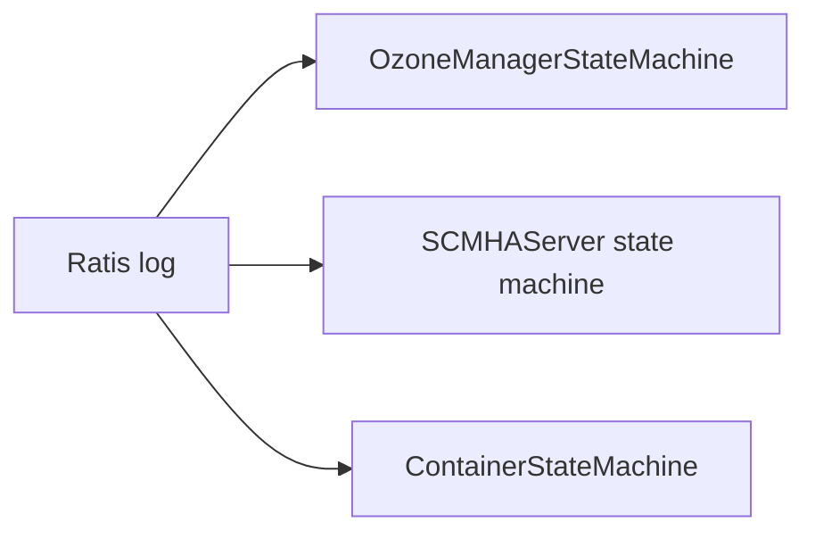

# Ratis consensus (OM + SCM + DN)

The three state machines that sit on top of Apache Ratis in Ozone: OM apply loop, SCM HA state machine, DN container state machine, plus …

1005 minutes · 30 classes

## Flow walkthrough
OM applies OMClientRequest logs, DN applies container-op logs, SCM applies HA logs. Each has its own state machine class; the plumbing (retry policy, snapshot info, transport) is shared across all three via hadoop-hdds/framework.

## Key classes on this path

1

<strong><a href="/class/localstream">LocalStream</a></strong>

inferred: LocalStream — role not documented.

DN/ratis-statemachine-dn · 90 min

2

<strong><a href="/class/containerstatemachine">ContainerStateMachine</a></strong>

A StateMachine for containers, which is responsible for handling different types of container requests.

DN/ratis-statemachine-dn · 60 min

3

<strong><a href="/class/xceiverserverratis">XceiverServerRatis</a></strong>

Creates a ratis server endpoint that acts as the communication layer for Ozone containers.

DN/ratis-statemachine-dn · 60 min

4

<strong><a href="/class/blockdeletingtask">BlockDeletingTask</a></strong>

BlockDeletingTask for KeyValueContainer.

DN/ratis-statemachine-dn · 60 min

5

<strong><a href="/class/stalerecoveringcontainerscrubbingservice">StaleRecoveringContainerScrubbingService</a></strong>

A per-datanode container stale recovering container scrubbing service takes in charge of deleting stale recovering co...

DN/ratis-statemachine-dn · 30 min

6

<strong><a href="/class/ratisserverconfiguration">RatisServerConfiguration</a></strong>

Holds configuration items for Ratis/Raft server.

DN/ratis-statemachine-dn · 30 min

7

<strong><a href="/class/dispatchercontext">DispatcherContext</a></strong>

DispatcherContext class holds transport protocol specific context info required for execution of container commands o...

DN/ratis-statemachine-dn · 10 min

8

<strong><a href="/class/csmmetrics">CSMMetrics</a></strong>

This class is for maintaining Container State Machine statistics.

DN/ratis-statemachine-dn · 20 min

9

<strong><a href="/class/retrypolicycreator">RetryPolicyCreator</a></strong>

The interface of RetryLimited policy creator.

HddsCommon/ratis-integration · 20 min

10

<strong><a href="/class/ratishelper">RatisHelper</a></strong>

Ratis helper methods.

HddsCommon/ratis-integration · 60 min

## What to understand before moving on
- Explain the service boundary crossings in this path: DN -> HddsCommon -> OM -> Ratis-integration.
- Name the entry-point classes and the class that owns each durable state change.
- Identify the retry, failure, or cleanup behavior that keeps the path correct when a service is slow or unavailable.
- Open the individual class pages for invariants, sharp edges, source links, and test exemplars.
- Use these tags as anchors when searching later: `ratis`, `hot-path`.
## Full reading list
### DN — 8 classes · 360 min

**[ratis-statemachine-dn](/component/dn/ratis-statemachine-dn)** · 8 · 360 min

- [LocalStream](/class/localstream) — inferred: LocalStream — role not documented. 90 min
- [ContainerStateMachine](/class/containerstatemachine) — A StateMachine for containers, which is responsible for handling different types of container requests. 60 min
- [XceiverServerRatis](/class/xceiverserverratis) — Creates a ratis server endpoint that acts as the communication layer for Ozone containers. 60 min
- [RatisServerConfiguration](/class/ratisserverconfiguration) — Holds configuration items for Ratis/Raft server. 30 min
- [DispatcherContext](/class/dispatchercontext) — DispatcherContext class holds transport protocol specific context info required for execution of container commands o... 10 min
- [CSMMetrics](/class/csmmetrics) — This class is for maintaining Container State Machine statistics. 20 min
- [BlockDeletingTask](/class/blockdeletingtask) — BlockDeletingTask for KeyValueContainer. 60 min
- [StaleRecoveringContainerScrubbingService](/class/stalerecoveringcontainerscrubbingservice) — A per-datanode container stale recovering container scrubbing service takes in charge of deleting stale recovering co... 30 min

### HddsCommon — 11 classes · 240 min

**[ratis-integration](/component/hddscommon/ratis-integration)** · 11 · 240 min

- [RatisHelper](/class/ratishelper) — Ratis helper methods. 60 min
- [ContainerCommandRequestMessage](/class/containercommandrequestmessage) — Implementing the Message interface for ContainerCommandRequestProto. 30 min
- [ServerNotLeaderException](/class/servernotleaderexception) — Exception thrown when a server is not a leader for Ratis group. 10 min
- [RatisClientConfig](/class/ratisclientconfig) — Configuration related to Ratis Client. 20 min
- [RetryPolicyCreator](/class/retrypolicycreator) — The interface of RetryLimited policy creator. 20 min
- [RequestTypeDependentRetryPolicyCreator](/class/requesttypedependentretrypolicycreator) — Table mapping exception type to retry policy used for the exception in write and watch request. 30 min
- [RetryLimitedPolicyCreator](/class/retrylimitedpolicycreator) — The creator of RetryLimited policy. 30 min
- [SCMNodeInfo](/class/scmnodeinfo) — Class which builds SCM Node Information. 10 min
- [RetriableWithNoFailoverException](/class/retriablewithnofailoverexception) — This exception indicates that the request can be retried, but only on the same server, without failover. 10 min
- [RetriableWithFailOverException](/class/retriablewithfailoverexception) — This exception indicates that the request can be retried, and client need to retry on the next server. 10 min
- [NonRetriableException](/class/nonretriableexception) — exception for which there should be no retry. 10 min

### OM — 7 classes · 310 min

**[om-ratis](/component/om/om-ratis)** · 7 · 310 min

- [OzoneManagerRatisServer](/class/ozonemanagerratisserver) — Creates a Ratis server endpoint for OM. 60 min
- [OzoneManagerStateMachine](/class/ozonemanagerstatemachine) — The OM StateMachine is the state machine for OM Ratis server. 60 min
- [OzoneManagerDoubleBuffer](/class/ozonemanagerdoublebuffer) — This class implements DoubleBuffer implementation of OMClientResponse's. 60 min
- [OzoneManagerRatisServerConfig](/class/ozonemanagerratisserverconfig) — Class which defines OzoneManager Ratis Server config. 20 min
- [OzoneManagerDoubleBufferMetrics](/class/ozonemanagerdoublebuffermetrics) — Class which maintains metrics related to OzoneManager DoubleBuffer. 20 min
- [OmRatisSnapshotProvider](/class/omratissnapshotprovider) — OmRatisSnapshotProvider downloads the latest checkpoint from the leader OM and loads the checkpoint into State Machine. 45 min
- [OzoneManagerRatisUtils](/class/ozonemanagerratisutils) — Utility class used by OzoneManager HA. 45 min

### Ratis-integration — 4 classes · 95 min

**[ratis-integration](/component/ratis-integration/ratis-integration)** · 4 · 95 min

- [RatisMetricsUtils](/class/ratismetricsutils) — Utilities for ratis metrics dropwizard3. 20 min
- [SCMHandler](/class/scmhandler) — Base interface for SCM handlers participating in Ratis-based HA. 20 min
- [SCMHAUtils](/class/scmhautils) — Utility class used by SCM HA. 45 min
- [SequenceIdType](/class/sequenceidtype) — Represents the sequence ID types managed by org.apache.hadoop.hdds.scm.ha.SequenceIdGenerator The enum constant names... 10 min
