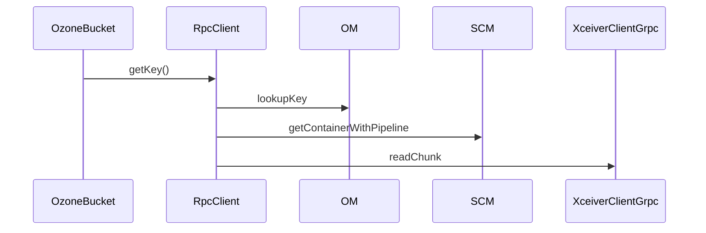

# Read path end-to-end

Follow one key read from OzoneBucket down to the datanode chunk read, including pipeline resolution and EC-vs-Ratis divergence at the inp…

450 minutes · 8 classes

## Flow walkthrough
Reads split at the input-stream layer: RATIS keys route through KeyInputStream; EC keys route through ECKeyInputStream and rebuild missing cells via the reconstruction input stream. Both funnel through XceiverClientGrpc.

## Key classes on this path

1

<strong><a href="/class/ozonebucket">OzoneBucket</a></strong>

A class that encapsulates OzoneBucket.

Client/ozone-client · 60 min

2

<strong><a href="/class/rpcclient">RpcClient</a></strong>

Ozone RPC Client Implementation, it connects to OM, SCM and DataNode to execute client calls.

Client/ozone-client · 60 min

3

<strong><a href="/class/keyinputstream">KeyInputStream</a></strong>

Maintaining a list of BlockInputStream.

Client/ozone-client · 30 min

4

<strong><a href="/class/ecblockreconstructedstripeinputstream">ECBlockReconstructedStripeInputStream</a></strong>

Class to read EC encoded data from blocks a stripe at a time, when some of the data blocks are not available.

Client/hdds-client · 60 min

5

<strong><a href="/class/blockinputstream">BlockInputStream</a></strong>

An InputStream called from KeyInputStream to read a block from the container.

Client/hdds-client · 60 min

6

<strong><a href="/class/chunkinputstream">ChunkInputStream</a></strong>

An InputStream called from BlockInputStream to read a chunk from the container.

Client/hdds-client · 60 min

7

<strong><a href="/class/xceiverclientgrpc">XceiverClientGrpc</a></strong>

XceiverClientSpi implementation, the standalone client.

Client/hdds-client · 60 min

8

<strong><a href="/class/keyvaluehandler">KeyValueHandler</a></strong>

Handler for KeyValue Container type.

DN/kv-container · 60 min

## What to understand before moving on
- Explain the service boundary crossings in this path: Client -> DN.
- Name the entry-point classes and the class that owns each durable state change.
- Identify the retry, failure, or cleanup behavior that keeps the path correct when a service is slow or unavailable.
- Open the individual class pages for invariants, sharp edges, source links, and test exemplars.
- Use these tags as anchors when searching later: `read-path`, `hot-path`.
## Full reading list
### Client — 7 classes · 390 min

**[hdds-client](/component/client/hdds-client)** · 4 · 240 min

- [XceiverClientGrpc](/class/xceiverclientgrpc) — XceiverClientSpi implementation, the standalone client. 60 min
- [ChunkInputStream](/class/chunkinputstream) — An InputStream called from BlockInputStream to read a chunk from the container. 60 min
- [BlockInputStream](/class/blockinputstream) — An InputStream called from KeyInputStream to read a block from the container. 60 min
- [ECBlockReconstructedStripeInputStream](/class/ecblockreconstructedstripeinputstream) — Class to read EC encoded data from blocks a stripe at a time, when some of the data blocks are not available. 60 min

**[ozone-client](/component/client/ozone-client)** · 3 · 150 min

- [RpcClient](/class/rpcclient) — Ozone RPC Client Implementation, it connects to OM, SCM and DataNode to execute client calls. 60 min
- [OzoneBucket](/class/ozonebucket) — A class that encapsulates OzoneBucket. 60 min
- [KeyInputStream](/class/keyinputstream) — Maintaining a list of BlockInputStream. 30 min

### DN — 1 class · 60 min

**[kv-container](/component/dn/kv-container)** · 1 · 60 min

- [KeyValueHandler](/class/keyvaluehandler) — Handler for KeyValue Container type. 60 min

<UnresolvedNote context="this view's selectors" items={["org.apache.hadoop.ozone.client.io.ECKeyInputStream","org.apache.hadoop.ozone.om.request.key.OMKeyLookupRequest"]} />