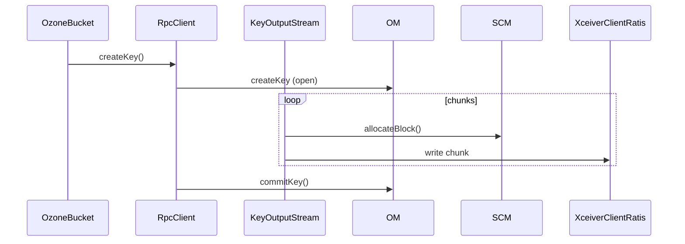

# Write path end-to-end

Follow one key write from the OzoneBucket API down to a chunk on disk on a datanode, crossing the client, OM, SCM and DN service boundaries.

650 minutes · 14 classes

## Flow walkthrough
The linear list below is a reading order that mirrors the actual RPC / data flow. It does not include every helper each stage uses — for that, follow the backlinks on the individual class pages.

## Key classes on this path

1

<strong><a href="/class/ozonebucket">OzoneBucket</a></strong>

A class that encapsulates OzoneBucket.

Client/ozone-client · 60 min

2

<strong><a href="/class/rpcclient">RpcClient</a></strong>

Ozone RPC Client Implementation, it connects to OM, SCM and DataNode to execute client calls.

Client/ozone-client · 60 min

3

<strong><a href="/class/keyoutputstream">KeyOutputStream</a></strong>

Maintaining a list of BlockInputStream.

Client/ozone-client · 60 min

4

<strong><a href="/class/blockoutputstreamentrypool">BlockOutputStreamEntryPool</a></strong>

A BlockOutputStreamEntryPool manages the communication with OM during writing a Key to Ozone with KeyOutputStream.

Client/ozone-client · 45 min

5

<strong><a href="/class/blockoutputstreamentry">BlockOutputStreamEntry</a></strong>

A BlockOutputStreamEntry manages the data writes into the DataNodes.

Client/ozone-client · 45 min

6

<strong><a href="/class/blockoutputstream">BlockOutputStream</a></strong>

An OutputStream used by the REST service in combination with the SCMClient to write the value of a key to a sequence...

Client/hdds-client · 60 min

7

<strong><a href="/class/xceiverclientratis">XceiverClientRatis</a></strong>

An abstract implementation of XceiverClientSpi using Ratis.

Client/hdds-client · 45 min

8

<strong><a href="/class/xceiverclientgrpc">XceiverClientGrpc</a></strong>

XceiverClientSpi implementation, the standalone client.

Client/hdds-client · 60 min

9

<strong><a href="/class/omkeycreaterequest">OMKeyCreateRequest</a></strong>

Handles CreateKey request.

OM/om-request-key · 10 min

10

<strong><a href="/class/omkeycommitrequest">OMKeyCommitRequest</a></strong>

Handles CommitKey request.

OM/om-request-key · 10 min

## What to understand before moving on
- Explain the service boundary crossings in this path: Client -> OM -> SCM -> DN.
- Name the entry-point classes and the class that owns each durable state change.
- Identify the retry, failure, or cleanup behavior that keeps the path correct when a service is slow or unavailable.
- Open the individual class pages for invariants, sharp edges, source links, and test exemplars.
- Use these tags as anchors when searching later: `write-path`, `hot-path`.
## Full reading list
### Client — 8 classes · 435 min

**[hdds-client](/component/client/hdds-client)** · 3 · 165 min

- [XceiverClientGrpc](/class/xceiverclientgrpc) — XceiverClientSpi implementation, the standalone client. 60 min
- [XceiverClientRatis](/class/xceiverclientratis) — An abstract implementation of XceiverClientSpi using Ratis. 45 min
- [BlockOutputStream](/class/blockoutputstream) — An OutputStream used by the REST service in combination with the SCMClient to write the value of a key to a sequence... 60 min

**[ozone-client](/component/client/ozone-client)** · 5 · 270 min

- [RpcClient](/class/rpcclient) — Ozone RPC Client Implementation, it connects to OM, SCM and DataNode to execute client calls. 60 min
- [OzoneBucket](/class/ozonebucket) — A class that encapsulates OzoneBucket. 60 min
- [KeyOutputStream](/class/keyoutputstream) — Maintaining a list of BlockInputStream. 60 min
- [BlockOutputStreamEntry](/class/blockoutputstreamentry) — A BlockOutputStreamEntry manages the data writes into the DataNodes. 45 min
- [BlockOutputStreamEntryPool](/class/blockoutputstreamentrypool) — A BlockOutputStreamEntryPool manages the communication with OM during writing a Key to Ozone with KeyOutputStream. 45 min

### DN — 3 classes · 150 min

**[kv-container](/component/dn/kv-container)** · 1 · 60 min

- [KeyValueHandler](/class/keyvaluehandler) — Handler for KeyValue Container type. 60 min

**[kv-container-impl](/component/dn/kv-container-impl)** · 2 · 90 min

- [FilePerBlockStrategy](/class/fileperblockstrategy) — This class is for performing chunk related operations. 45 min
- [BlockManagerImpl](/class/blockmanagerimpl-4cf7b6) — This class is for performing block related operations on the KeyValue Container. 45 min

### OM — 2 classes · 20 min

**[om-request-key](/component/om/om-request-key)** · 2 · 20 min

- [OMKeyCommitRequest](/class/omkeycommitrequest) — Handles CommitKey request. 10 min
- [OMKeyCreateRequest](/class/omkeycreaterequest) — Handles CreateKey request. 10 min

### SCM — 1 class · 45 min

**[block-manager](/component/scm/block-manager)** · 1 · 45 min

- [BlockManagerImpl](/class/blockmanagerimpl-04f7a5) — Block Manager manages the block access for SCM. 45 min
